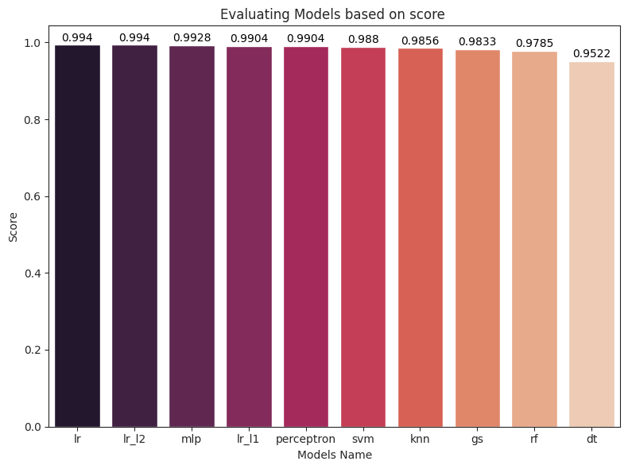

# SMS Spam Classifier  
- Using BERT model for SMS text tokenizer.
- Evaluate different model's performance.


## SMS Spam Collection Dataset : [[Kaggle]](https://www.kaggle.com/datasets/uciml/sms-spam-collection-dataset)
The SMS Spam Collection is a set of SMS tagged messages that have been collected for SMS Spam research. It contains one set of SMS messages in English of 5,574 messages, tagged acording being ham (legitimate) or spam. 

## Run
```
Spam_Message_BERT_tokenize.ipynb
```

### Results

<p align="center"></p> 
<p align="center"><i>Figure 1: Model scores </i></p> 
